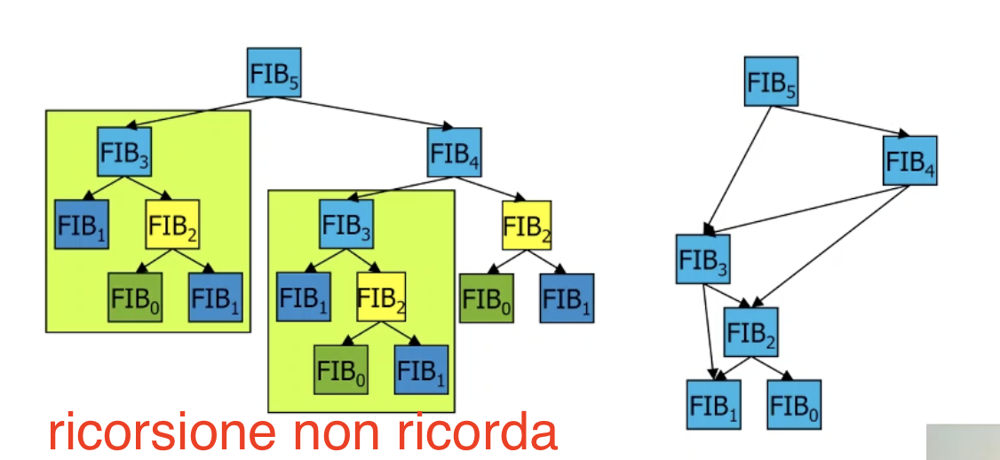
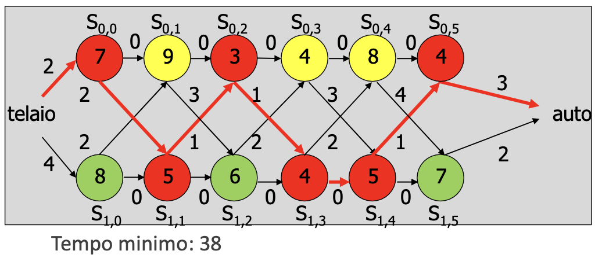
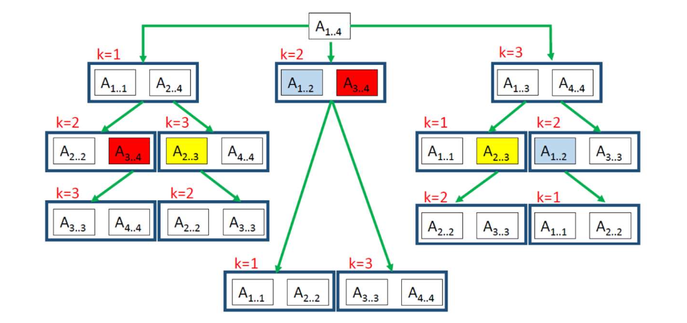

[30/11/23] In questa lezione 

- [Programmazione dinamica](#programmazione-dinamica)
  - [Esempio della catena di montaggio](#esempio-della-catena-di-montaggio)
    - [Soluzione](#soluzione)
    - [Soluzione ricorsiva](#soluzione-ricorsiva)
    - [Soluzione programmazione dinamica](#soluzione-programmazione-dinamica)
  - [Esempio della moltiplcazione di matrici](#esempio-della-moltiplcazione-di-matrici)
    - [Soluzione](#soluzione-1)
    - [Soluzione ricorisva](#soluzione-ricorisva)
    - [Soluzione ottima: calcolo bottom-up del valore](#soluzione-ottima-calcolo-bottom-up-del-valore)
      - [Strutture dati:](#strutture-dati)
      - [Algoritmo:](#algoritmo)
  - [Esempio del cammino semplice massimo o minimo](#esempio-del-cammino-semplice-massimo-o-minimo)
  - [Tabella riassuntiva](#tabella-riassuntiva)


Limti della ricorsione:
- Ipotizziamo che ogni probelma sia indipendente, cioè diverso uno dall'altro. Quindi se sono uguali non ce lo ricordiamo e calcoliamo di nuovo la soluzione al sottoproblema.

- Occupa molto spazio in memoria

# Programmazione dinamica
Paradigma alternativo applicato a problemi di ottimizzazione
- memorizza le soluzioni ai sottoproblemi man mano che vengono trovate
- prima di risolvere un sottoproblema, controlla se è già stato risolto
- riusa le soluzioni ai sottoproblemi già risolti
- meglio del divide et impera per sottoproblemi condivisi

Può essere:
- bottom-up (da problemi elementari di partenza, aumentando la complessità), mentre il divide et impera è top-down
- top-down e si dice ricorsione con memorizzazione o
memoization

La Programmazione Dinamica è applicabile solo a quei problemi di ottimizzazione che hanno una **sottostruttura ottima**, cioè che la soluzione ottima al problema globale può essere ottenuta combinando le soluzioni ottime ai sottoproblemi.

## Esempio della catena di montaggio
Vogliamo passare da telaio a automobile, e per fare ciò dobbiamo passare da n stazioni. Abbiamo due file di queste n stazioni, una di fianco all'altra, e ogni stazione nella file fa la stessa cosa della stazione di fianco (altra fila stesso indice). Però lo fanno con un tempo diverso. Inoltre per passare da una fila all'altra ci va un cetro tempo, diverso per ogniuna delle 2n stazioni.

Vogliamo costruire la macchina nel minor tempo possibile.

Soluzione forza bruta: provare tutti i eprcorsi possibili.
Soluzione programmazione dinamica: possiamo usarla perchè il tmepo minimo alla posizione j, implica che il tempo a j-1 sia minimo

### Soluzione
Sappiamo che in un percorso minimo, il percorso fino al penultimo nodo è minimo (**sottostruttura ottima**). Quindi per risolvere il problema, immaginiamo di avere già il percorso risolto (quindi già che esce dalla catena di montaggio) e immaginiamo che l'ulitmo nodo è nella catena 0. Quindi il percorso all'ultimo nodo della catena 0 è minimo. Se invece non sappiamo il percorso, ci basta calcolare il percorso minimo all'ultimo nodo della catena 0, il minimo all'ultimo nodo della catena 1, e poi vedere con il tempo di uscita quale dei due nodi includere nel percorso minimo totale. E coem facciamo a trovare il percorso minimo agli ultimo nodo della catena 0 e 1? Bè la stessa cosa. per trovare il percorso minimo all'ultimo nodo della catena 0 epr esempio, ci torviamo il minimo al penultimo nodo della catena 0, e il minimo al penultimo nodo della catena 1. Poi teniamo in conto i tempi di lavorazione (per il penultimo nodo della catena 0), e i tempi di trasferimento e lavorazione (per il penultimo nodo della catena 1), e vediamo quale dei due includere nel minimio totale.

Questo algoritmo si presta bene alla soluzione ricorsiva

### Soluzione ricorsiva
il codice completo è in `01assembly_line.c`
complessità: O(2^n)

### Soluzione programmazione dinamica
Useremo due vettori (`f0` e `f1`) (messi in una tabella). `f0[j]` sarà il tempo minimo per arrivare al j-esimo nodo della catena 0. `f1[j]` sarà il tempo minimo per arrivare al j-esimo nodo della catena 1.\
Iterando su tutti i nodi:\
per il nodo j della catena 0, vediamo se ci si mette meno ad arrivarci dal nodo j-1 della stessa catena (0), o dal nodo j-1 dell'altra catena (1).
E facciamo lo stesso per il nodo j della catena 1.
Useremo altri due vettori (`l1` e `l2`) (anch'essi in tabella) per tenere conto se il percorso minimo passa per il nodo j-1 della catena 0 o della catena 1.\

Una volta trovato il tempo minimo per arrivare alla fine della catena, ripercorriamo all'indietro i vettori `l` per trovare il percorso minimo.

complessità: O(n)

## Esempio della moltiplcazione di matrici
(è utile in computer grafica. Una matrice è una trasformazione, e se vogliamo fare più trasformazioni, dobbiamo moltiplicare le matrici)

Ovviamente si possono moltiplicare solo le matrici\
nr1 x nc1 * nr2 x nc2 tali che n1c==nr2
Ecco un algoritmo semplice per moltiplicare due matrici: che è di complessità O(nr1 * nc1 * nc2)
``` c
void matrMult(int **A, int **B, int **C, int nr1, int nc1, int nc2) {
  int i, j, k;

  for (i=0; i<nr1; i++)
    for (j=0; j<nc2; j++) {
      C[i][j] = 0;
      for (k=0; k<nc1; k++)
        C[i][j] =  C[i][j] + A[i][k]*B[k][j];
    }
}
```

Se dobbiamo moltiplicare più matrici, cambia qualcosa la parentesizzazione?
Esempio: A1·A2·A3 dove A1 10x100, A2 100x 5, A3 5x50

(A1·A2)·A3
- costo di A1·A2 10x100x5 = 5000, risultato A12 10x5
- costo di A12·A3 10x5x50 = 2500
- costo totale 7500

A1·(A2·A3)
- costo di A2·A3 100x5x50 = 25000, risultato A23 100x50
- costo di A1·A23 10x100x50 = 50000
- costo totale 75000

Quindi dobbiamo trovare la parentesizzazione che costa meno. Innanzitutto in quanti modi possiamo parentesizzare n matrici? C(n-1), dove c sono i numeri di Catalan.\
$C(n) = \frac{1}{n+1} {2n \choose n}$

### Soluzione
Per trovare il costo minimo, prendo la sequenza di n matrici, e la spezzo in due sottosequenze. Trovo il costo minimo di quelle due sottosequneze, trovo il costo di moltiplicare le due matrici risultanti, e sommo questi tre costi. Ovviamnete devo considerare tutti i possibili modi di spezzare una sequenza, quindi n-1 modi, e tenere solo il minimo

Questa soluzione si presta bene al paradigma ricorsivo:
### Soluzione ricorisva
codice in `03matr_chain_mult.c`
Complessità O(2^n)
Come si può vedere dall'immagine, molti sottoproblemi sono gli stessi, e vengono risolti di nuovo.


### Soluzione ottima: calcolo bottom-up del valore
#### Strutture dati:
- $A_i$ matrici $p_{i-1}$ x $p_i$ con i=1, 2,...,n
- vettore p delle dimensioni
- tabella m triangolare. Nell'elemento m[i, j] è memorizzato il costo di moltiplicare la sequenza di matrici $A_i * A_{i+1} * ... * A_{j-1} * A_j$.
- tabella s[1...n, 1...n] per tenere traccia del valore ottimo di k
per ricostruire la soluzione

#### Algoritmo:
- Se la serie è lunga 1 il costo è 0 (una sola matrice)
- Se la serie di matrici è lunga 2, il costo è il prodotto delle tre dimensioni
- Se la catena è lunga tre, per esempio le matrici $A_1$, $A_2$, $A_3$, il costo minimo è
  - m[1,1] (=0) + m[2,3] + prodotto delle dimensioni, oppure
  - m[1,2] + m[3,3] (=9) + prodotto delle dimensioni.
  (nota: non ci sono solo le matrici $A_1$, $A_2$, $A_3$, ma anche $A_2$, $A_3$, $A_4$ e così via )
- Se la catena è lunga 4, per esempio le matrici $A_1$, $A_2$, $A_3$, $A_4$, il costo minimo è 
  - m[1,1] + m[2,4] + prodotto delle dimensioni 0, 1, 4 ,oppure
  - m[1,2] + m[3,4] + prodotto delle dimensioni 0, 2, 4 ,oppure
  - m[1,3] + m[4,4] + prodotto delle dimensioni 0, 3, 4
  dove ho usato il costo dei sottoinsiemi di lunghezza 3.
  (nota: non ci sono solo le matrici $A_1$, $A_2$, $A_3$, $A_4$, ma anche $A_2$, $A_3$, $A_4$, $A_5$ e così via )

Qundi per trovare la soluzione ottima, devo calcolare il costo di tutte le sottosequenze e combinarli come descritto sopra. Pseudocodice:
``` python
for i from 1 to n:
  m[i, i] = 0

for l from 2 to n: # lunghezza della sottosequenza
    # itera su tutte le sottosequenze di lunghezza l che ci sono tra 0 e n
    # i è l'indice di inizio della sottosequenza
    for i from 1 to n-l+1:
        j = i+l-1 # estremo destro della sottosequenza
        m[i, j] = +inf
        # itera su tutti i possibili modi di spezzare la sottosequenza
        for k from i to j-1:
            # calcola costo
            q = m[i, k] + m[k+1, j] + p[i-1]*p[k]*p[j]
            if q < m[i, j]:
                m[i, j] = q
                s[i, j] = k
```
il codice intero sta a pag 58

## Esempio del cammino semplice massimo o minimo
Questo problema non ha una sottostruttura ottima, quindi non si può risolvere con la programmazione dinamica. Il problema dei cammini massimi è NP-completo. Qundi se potessimo trovare una soluzione in tempo polinomiale, allora potremmo risolvere tutti i problemi NP-completi in tempo polinomiale.

## Tabella riassuntiva
| Divide et impera | Programmazione dinamica |
|------------------|-------------------------|
| tutti i tipi di problemi | solo problemi di ottimizzazione |
| Sottoproblemi indipendenti | Sottoproblemi dipendenti |
| Top-down         | Bottom-up               |
| Ricorsione       | Cicli                   |

