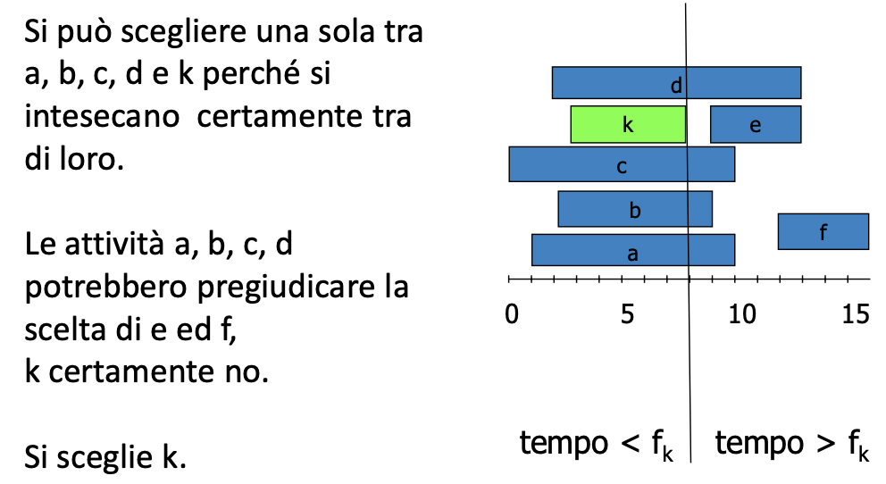

[3/12/2023] In questa lezione abbiamo visto il paradigma greedy, come non sempre è possibile utilizzarlo, e come funziona il codice di Huffman.

- [Paradigma Greedy](#paradigma-greedy)
  - [Esempio Numero di attività massime](#esempio-numero-di-attività-massime)
    - [Codice](#codice)
  - [Esempio attività di durata massima](#esempio-attività-di-durata-massima)
  - [Esempio minimo numero di monete](#esempio-minimo-numero-di-monete)
  - [Esempio dello zaino discreto](#esempio-dello-zaino-discreto)
  - [Esempio dello zaino continuo](#esempio-dello-zaino-continuo)
    - [Codice](#codice-1)
- [Codici di cose](#codici-di-cose)
  - [Esempio:](#esempio)
  - [Codice Prefisso](#codice-prefisso)
  - [Codice di Huffman](#codice-di-huffman)


# Paradigma Greedy
Il paradigma greedy è un’alternativa per i problemi di ottimizzazione all’approccio divide et impera e alla programmazione dinamica in generale. E di minor complessità, quindi più rapido, ma non sempre in grado di ritornare sempre una soluzione ottima. A ogni passo per tentare di trovare una soluzione globalmente ottima si scelgono soluzioni localmente ottime sulla base di una funzione di appetibilità (costo). no backtrack. soluzione non necessariamente ottima, in quanto non è detto che lo spazio delle possibilità sia esplorato in maniera esaustiva.

Si parte da un insieme di soluzioni vuoto, e si procede in ordine di appetibilità, aggiungendo una soluzione alla volta, fino a quando non si raggiunge una soluzione completa. La soluzione finale è quella che ha il costo minore tra tutte quelle generate.

## Esempio Numero di attività massime
Esempio: abbiamo un insieme di n attività con un tempo di inizio e un tempo di fine. Vogliamo trovare il sottoinsieme di attività che non si sovrappongono e che ha il numero massimo di attività (non lunghezza massima).

Se il criterio di appetibità fosse il tempo di inizio, la soluzione non sarebbe ottima. se fosse la durata, anche potremmo perderci la soluzione ottima. Se scegliamo come appetibilità il tempo di fine, otteniamo la soluzione ottima.



### Codice
```c
typedef struct {
  char name[MAXC];
  int start;
  int stop;
  int selected;
} Item;


void select(Item *act, int n) {
  int i, stop;

  KEYsetSel(&act[0]);
  stop = KEYgetStop(act[0]);

  for (i=1; i<n; i++)
    if (KEYgetStart(act[i]) >= stop) {
      KEYsetSel(&act[i]);
      stop = KEYgetStop(act[i]);
    }
}
```

(il codice completo è in `01activityselection`)

## Esempio attività di durata massima
Dato un input di n attività, trovare il sottoinsieme di attività che non si sovrappongono e che ha durata massima. In questo caso il paradigma greedy non funziona, perché non è possibile trovare una funzione di appetibilità che ci permetta di trovare la soluzione ottima. In questo caso è necessario utilizzare la programmazione dinamica o ricorsiva.

## Esempio minimo numero di monete
Dato un insieme di monete di valore diverso, trovare il minimo numero di monete necessarie per restituire un certo ammontare. Potremmo pensare di utilizzare come criterio di appetibilità il valore della moneta. Cioè scegli la moneta più grande che è minore del resto da restituire, e continua così finchè non è finito il resto. Questo però non funziona, perché potremmo perdere la soluzione ottima. Ad esempio, se abbiamo monete da 1, 3 e 4, e dobbiamo restituire 6, la soluzione greedy ci darebbe 4+1+1, mentre la soluzione ottima è 3+3.

(codice in `02changemachine`)

## Esempio dello zaino discreto
Dato un insieme di N oggetti ciascuno dotato di peso wj e di valore vj e dato un peso massimo cap, determinare il sottoinsieme S di oggetti tali che la somma dei pesi sia minore o uguale a cap e la somma dei valori sia massima.

Si potrebbe scegliere come appetibilità la densità del'oggetto cioè valore / peso. Ma non funziona, perché potremmo perdere la soluzione ottima. Ad esempio, se abbiamo:
| oggetto | peso | valore | densità |
|---------|------|--------|---------|
| 1       | 10   | 60     | 6       |
| 2       | 20   | 100    | 5       |
| 3       | 30   | 120    | 4       |

`cap = 50`

La soluzione greedy ci darebbe oggeto 1 e 2, mentre la soluzione ottima è oggetto 3.

## Esempio dello zaino continuo
Dato un insieme di N liquidi, ciascuno in una certa massima quantità e ciascuno con un certo valore, e dato un volume massimo trovare il misuglio di liquidi che massimizzi il valore totale, senza superare il volume massimo. In questo caso il paradigma greedy con densità funziona.

### Codice
```c
typedef struct {
  char name[MAXC];
  int weight;
  int value;
  float density;
  float selected;
} Item;


float knapsack(int n, Item *objects, float cap) {
  float stolen = 0.0, res = cap;
  int i;
  for (i=0; i<n && (KEYgetW(objects[i]) <= res);i++) {
    KEYsetF(&objects[i], 1.0);
    stolen = stolen + KEYgetV(objects[i]);
    res = res - objects[i].weight;
  }
  KEYsetF(&objects[i], res/KEYgetW(objects[i]));
  stolen = stolen + KEYgetF(objects[i])*KEYgetV(objects[i]);
  return stolen;
}
```

(codice completo in `03fractionalknapsack`)

# Codici di cose
Se io ho un insieme `S` contenente `card(S)` elementi, e voglio trovare un codice per rappresentare questi elementi posso usare un codice a lunghezza fissa o variablie.

Codice a lunghezza fissa:
- numero di bit per rappresentare ogni elemento: $n = \lceil log_2(card(S)) \rceil$
- vantaggio: facilità di decodifica
- è usato per simboli isofrequenti

Codice a lunghezza variabile:
- svantaggio: difficoltà di decodifica
- vantaggio: risparmio di spazio di memoria
- uso: simboli con frequenze diverse.

## Esempio:
Ho un alfabeto di 6 lettere, con queste frequenze (ogni cento lettere):
| | a | b | c | d | e | f |
|-|---|---|---|---|---|---|
|frequenza| 45 | 13 | 12 | 16 | 9 | 5 |
| codice fisso | 000 | 001 | 010 | 011 | 100 | 101 |
| codice variabile | 0 | 101 | 100 | 111 | 1101 | 1100 |

e ho un file di 100 000 caratteri. Memorizzarlo con il codice fisso richiederebbe `100 000 * 3 = 300 000 bit`. Memorizzarlo con il codice variabile richiederebbe `(45 * 1 + 13 * 3 + 12 * 3 + 16 * 3 + 9 * 4 + 5 * 4)*1000 = 224 000 bit`. In questo caso il codice variabile è più conveniente.

## Codice Prefisso
Nota: il codice mostrato nell'esempio precedente è un **codice prefisso**, cioè nessuna parola di codice è prefisso di un altra parola di codice. Questo è necessario per poter decodificare il codice, altrimenti come faccio a sapere dove finisce una parola e inizia l'altra? La **codiifica** si fa giustapponendo le parole di codice, e la **decodifica** si fa percorrendo un albero binario!


## Codice di Huffman
Un codice di Huffman è quello appena descritto, cioè un codice prefisso, dove le parole di codice sono scelte in modo da minimizzare la lunghezza media del codice. Questo è un codice ottimale, cioè non esiste un codice prefisso che ha una lunghezza media minore.

Lo si costruisce usando una coda a priorità (come un vettore ordinato in base a un criterio di proprietà).
- Si prendono i due elementi con frequenza minore e si costruisce un albero binario con questi due elementi come figli e la somma delle loro frequenze come frequenza della radice.
- Si inserisce l'albero nella coda a priorità.
- Si ripete finchè non rimane un solo albero.

(vedi esempio a pagina 54-60 delle slides)
