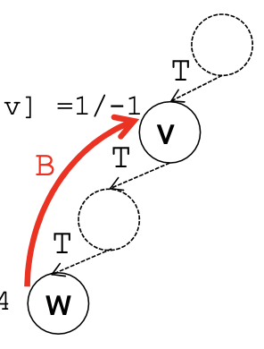
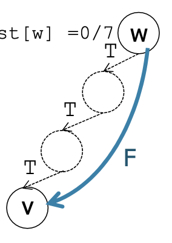
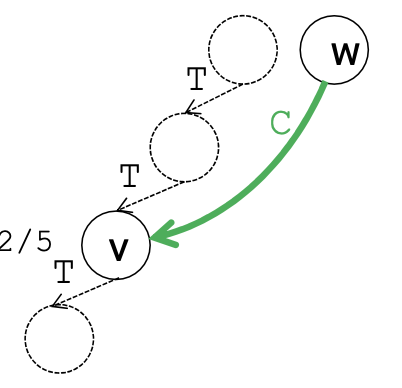

[18/12/2023] In questa lezione si parla di algoritmi di visita dei grafi, della visita in profondità e della visita in ampiezza. Il concetto chaive della visita in profondità è: partendo da un vertice, visitare un suo vicino, e da quel vicino un suo vicino, e così via. Quando si finiscono i vicini si torna indietro. La visita in ampiezza invece usa una queue. Partendo da un vertice visita tutti i vicini di un vertice subito, e poi passa algi altri, che intanto ha messo nella queue.

- [Gli algoritmi di visita dei grafi](#gli-algoritmi-di-visita-dei-grafi)
  - [Visita in profondità (dfs)](#visita-in-profondità-dfs)
    - [Versione base](#versione-base)
      - [Strutture dati e algoritmo](#strutture-dati-e-algoritmo)
    - [Versione estesa](#versione-estesa)
      - [Strutture dati e algoritmo](#strutture-dati-e-algoritmo-1)
    - [Versione completa](#versione-completa)
      - [Strutture dati e algoritmo](#strutture-dati-e-algoritmo-2)
    - [Complessità](#complessità)
    - [Flood Fill](#flood-fill)
  - [Visita in ampiezza (bfs)](#visita-in-ampiezza-bfs)
    - [Strutture dati necesarie](#strutture-dati-necesarie)
    - [Pseudo codice](#pseudo-codice)
    - [Codice](#codice)
    - [Complessità](#complessità-1)
    - [Numeri di Erdos](#numeri-di-erdos)


# Gli algoritmi di visita dei grafi
Sono algoritmi che partendo da un vertice di un grafo, seguono gli archi con una certa strategia per visitare tutti i vertici del grafo. Questi algoritmi sono utili per esplorare un grafo e per trovare informazioni su di esso. Le due principali strategie di visita sono la visita in profondità (DFS) e la visita in ampiezza (BFS).

## Visita in profondità (dfs)
Dato un grafo (connesso o non connesso), a partire da un vertice `s`, visita tutti i vertici del grafo (raggiungibili da s e non). (nota: alcuni libri invece chiamano la visita in profondità quella che da un vertice visita solo i vertici raggiungibili da esso)

### Versione base
Il principio base della visita in profondità è posizionarsi su un vertice e esplorare i vertici adiacenti non ancora scoperti. Cosa sono i vertici scoperti? Sono i vertici che sono stati visitati e che sono stati aggiunti alla coda. Scoprire un vertice vuol dire visitarlo per la prima volta. Per ogni vertice, la visita in profondità visita tutti i vertici adiacenti a esso prima di passare al prossimo vertice.

vedi l'esempio a pag 5-7

#### Strutture dati e algoritmo
- grafo non pesato come lista delle adiacenze
- vettore `pre` dove per ciascun vertice si registra il tempo di scoperta (numerazione in preordine dei vertici)

```c
// funzione ricorsiva che trova i vertici raggiungibili da s
static void simpleDfsR(Graph G, Edge e, int *cnt, int *pre) {
    link t; int w = e.w;
    pre[w] = (*cnt)++;
    // itera sulla lista di adiacenza del vertice w
    for (t = G->ladj[w]; t != G->z; t = t->next)
        if (pre[t->v] == -1)
            simpleDfsR(G, EDGEcreate(w, t->v), cnt, pre);
}
```

```c
// wrapper
void GRAPHsimpleDfs(Graph G, int id) {
    // inizializza variablili
    int v, cnt=0, *pre;
    pre = malloc(G->V * sizeof(int));
    if ((pre == NULL)) return;
    for (v=0;v<G->V;v++) pre[v]=-1;
    
    simpleDfsR(G, EDGEcreate(id,id), &cnt, pre);

    // dopo una visita potrebbe esserci ancora vertici non visitati, quindi li visito
    for (v=0; v < G->V; v++)
        if (pre[v]== -1)
            simpleDfsR(G, EDGEcreate(v,v), &cnt, pre);
  
    printf("discovery time labels \n");
    for (v=0; v < G->V; v++)
        printf("vertex %s : %d \n", STsearchByIndex(G->tab, v), pre[v]);
}
```

### Versione estesa
come l'altra ma con aggiunta di:
- nodi etichettati con etichetta tempo di scoperta / tempo di completamento (il tempo di completamento è il tempo in cui si è completata la visita di un nodo) (ricorda il tempo è l'indice di come è stato visitato in ordine. `cnt` per capirci, non il tempo reale in secondi)
- foresta di alberi (cioè più alberi) della visita in profondità, memorizzata in un vettore. Cioè degli alberi che rappresentano in che modo ho visitato i nodi.

vedi esempio a pag 13-25 delle slide

#### Strutture dati e algoritmo
- grafo non pesato come lista delle adiacenze
- vettori dove per ciascun vertice:
    - si registra il tempo di scoperta (numerazione in preordine dei vertici) `pre`
    - si registra il tempo di completamento (numerazione in postordine dei vertici) `post`
    - si registra il padre per la costruzione della foresta degli alberi della visita in profondità: `st`
- contatore `time` per tempi di scoperta/completamento

```c
static void ExtendedDfsR(Graph G, Edge e, int *time, int *pre, int *post, int *st) {
    link t; int w = e.w;
    st[e.w] = e.v;
    pre[w] = (*time)++;
    // itera sulla lista di adiacenza del vertice w
    for (t = G->ladj[w]; t != G->z; t = t->next)
        if (pre[t->v] == -1)
            ExtendedDfsR(G, EDGEcreate(w, t->v), time, pre, post, st);
    post[w] = (*time)++;
}
```
```c
// wrapper
void GRAPHextendedDfs(Graph G, int id) {
    // inizializza variablili
    int v, time=0, *pre, *post, *st;
    pre/post/st = malloc(G->V * sizeof(int));
    for (v=0;v<G->V;v++) {
        pre[v]=-1; post[v]=-1; st[v]=-1;}
    
    extendedDfsR(G, EDGEcreate(id,id), &time, pre, post, st);

    // dopo una visita potrebbe esserci ancora vertici non visitati, quindi li visito
    for (v=0; v < G->V; v++)
        if (pre[v]==-1)
            extendedDfsR(G,EDGEcreate(v,v),&time,pre,post,st);
    
    printf("discovery/endprocessing time labels \n");
    for (v=0; v < G->V; v++)
        printf("%s:%d/%d\n",STsearchByIndex(G->tab,v),pre[v],post[v]);
    printf("resulting DFS tree \n");
    for (v=0; v < G->V; v++)
        printf("%s’s parent: %s \n",STsearchByIndex (G->tab, v),
                STsearchByIndex (G->tab, st[v]));
}
```

### Versione completa
In più si etichettano anche gli archi. In un grafo non orientato li marchiamo con **T (tree)** se fanno parte dell'albero della visita in profondità, **B (back)** se non fanno parte dell'albero della visita in profondità.



Perchè si chiamano Back? bè perchè se non sono nell'albero, vuol dire che collegano un nodo w a un nodo v già scoperto prima (un antenato nell'albero di visita in profondità). Alla fine della ricorsione su v quindi l'etichetta di terminazione di v, il time, sarà maggiore della terminazione di w. L'etichetta di scoperta di v sarà minore della terminazione di w (sempre, anche prima di terminare il nodo v).

E se il grafo è orientato ci sono due nove classificazioni: **F (forward)** e **C (cross)**. Potrebbe succedere che l'arco considerato prima, che collega w e un suo antenato v, punti dall'antenato v a w. In questo caso si chiama nodo forward. Se un nodo non è nessuna delle 4 precedenti, si chiama nodo cross.




vedi gli esempi a pag 34-48 delle slide

ecco un riassunto delle condizioni da controllare per etichettare un arco da nodo A a nodo B:
- il tempo di inizio elaborazione di B non è ancora stato assegnato: arco Tree
- il tempo di inizio elaborazione di B è stato assegnato ma quello di fine non ancora: arco Back
- entrambi sono stati assegnati e il tempo di inizio elaborazione di B è maggiore del inizio elaborazione di A: arco Forward
- entrambi sono stati assegnati e il tempo di inizio elaborazione di B è minore del inizio elaborazione di A: arco Forward

#### Strutture dati e algoritmo
la funzione wrapper rimane la stessa, cambia solo la funzione ricorsiva
```c
void dfsR(Graph G, Edge e, int *time, int *pre, int *post, int *st){
    link t;
    int v, w = e.w;
    Edge x;
    if (e.v != e.w) // escludiamo l'arco fittizio usato per entrare nella ricorsione
        printf("(%s, %s):  T \n",STsearchByIndex(G->tab, e.v), STsearchByIndex(G->tab, e.w));
    st[e.w] = e.v;
    pre[w] = (*time)++;
    for (t = G->ladj[w]; t != G->z; t = t->next){
        // se il vertice non è stato visitato, ricorsione
        if (pre[t->v] == -1){ dfsR(G, EDGEcreate(w, t->v), time, pre, post, st); }
        else { // altrimenti lo etichetto
            v = t->v;
            x = EDGEcreate(w, v);
            // grafi non orientati --- inizio
            if (pre[w] < pre[v])
                printf("(%s, %s): B\n", STsearchByIndex(G->tab, x.v), STsearchByIndex(G->tab,x.w)) ;
            // grafi non orientati --- fine
            // // grafi orientati --- inizio
            // if (post[v] == -1) // se questo arco mi porta a un nodo non ancora visitato, B
            //     printf("(%s, %s): B\n", STsearchByIndex(G->tab, x.v), STsearchByIndex(G->tab, x.w));
            // else{
            //     if (pre[v] > pre[w])
            //         printf("(%s,%s):F\n",STsearchByIndex(G->tab, x.v), STsearchByIndex(G->tab, x.w));
            //     else
            //         printf("(%s,%s):C\n",STsearchByIndex(G->tab, x.v), STsearchByIndex(G->tab, x.w));
            // }
            // // grafi orientati --- fine
        }
    }
    post[w] = (*time)++;
}
```
### Complessità
Se il grafo è implementato con liste di adiacenza, scorro tutte le liste di adiacenza, quindi un totale di E passaggi. Inoltre inizializzo dei vettori pre, post e st di lunghezza V
Inizializzazione: O(V)
Ricorsione: O(E)
Totale: O(V+E)
Con la matrice di adiacenza invece devo per ogni vertice scorrere tutta la colonna corrispondente nella matadj, quindi O(V^2)

### Flood Fill
Un'applicazione della visita in profondità è il flood fill, che è un algoritmo utilizzato per colorare le aree di una immagine. L'idea è quella di partire da un punto e colorare tutti i punti adiacenti a esso con lo stesso colore. Questo algoritmo è utilizzato in molti programmi di grafica per colorare le aree di un'immagine.

## Visita in ampiezza (bfs)
A partire da un vertice `s` questo tipo di visita determina tutti i vertici raggiungibili da `s`, quindi non visita necessariamente tutti i vertici a differenza della DFS. inoltre calcola la distanza minima (in numero di archi, grafo non pesato) da `s` di tutti i vertici da esso raggiungibili

Il principio base è, dato un vertice, visitare tutti i vertici adiacenti a esso per prima. Questo significa che la visita in ampiezza visita tutti i vertici a distanza 1 da s, poi tutti i vertici a distanza 2 da s, e così via.

vedi gli esempi a pagina 57-68

### Strutture dati necesarie
- grafo non pesato come matrice di adiacenza
- coda `q` per memorizzare gli archi da visitare
- vettore `st` per memorizzare il padre di ciascun vertice (vogliamo costruire un albero di visita)
- vettore `pre` per i tempi di scoperta
- contatore `time`

### Pseudo codice
Matti l'arco fittizio (s,s) nella coda.\
Finchè la coda non è vuota:
- estrai dalla coda un arco (v,w)
- se w non è stato visitato:
    - etichetta il padre di w come v
    - etichetta w come visitato al tempo `time` e incrementa `time`
    - inserisci nella coda tutti gli archi (w,x) con x non ancora visitato

### Codice
Non si usa una funzione ricorsiva.
```c
void bfs(Graph G, Edge e, int *time, int *pre, int *st, int *dist) {
    int x;
    Q q = Qinit();
    Qput(q, e);
    dist[e.v]=-1;
    while (!Qempty(q)){
        if (pre[(e = Qget(q)).w] == -1) { // se il vertice non è stato visitato
            pre[e.w] = (*time)++;
            st[e.w] = e.v;
            dist[e.w] = dist[e.v]+1;
            // aggiungi alla coda tutti i vertici adiacenti a e.w non ancora visitati
            for (x = 0; x < G->V; x++)
                if (G->madj[e.w][x] == 1)
                    if (pre[x] == -1)
                        Qput(q, EDGEcreate(e.w, x));
        }
    }
}
```

```c
// wrapper
void GRAPHbfs(Graph G, int id) {
    // inizializza variablili
    int v, time=0, *pre, *st, *dist;
    for (v=0; v < G->V; v++) {
        pre[v] = -1; st[v] = -1; dist[v] = INT_MAX;
    }
    // visita in ampiezza
    bfs(G, EDGEcreate(id,id), &time, pre, st, dist);
    // visualizzazione albero di visita e livelli
    printf("\n Resulting BFS tree \n");
    for (v=0; v < G->V; v++)
    if (st[v] != -1)
        printf("%s’s parent is:%s\n",STsearchByIndex(G->tab, v), STsearchByIndex(G->tab, st[v]));
    printf("\n Levelizing \n");
    for (v=0; v < G->V; v++)
    if (st[v] != -1)
        printf("%s: %d \n",STsearchByIndex(G->tab,v),dist[v]);
}
```

### Complessità
O(V+E) con le liste di adiacenza, O(V^2) con la matrice di adiacenza

come la dfs

### Numeri di Erdos
Paul Erdos è stato un matematico ungherese che ha lavorato in molti campi della matematica, tra cui la teoria dei grafi. Ha scritto più di 1500 articoli, collaborando con più di 500 coautori. Per questo motivo, si è pensato di assegnare un numero di Erdos a tutti i matematici che hanno scritto un articolo con lui, e di assegnare un numero di Erdos a tutti gli altri matematici che hanno scritto un articolo con uno di questi matematici, e così via. Il numero di Erdos di Erdos è 0, il numero di Erdos di un matematico che ha scritto un articolo con Erdos è 1, il numero di Erdos di un matematico che ha scritto un articolo con un matematico che ha scritto un articolo con Erdos è 2, e così via. Il numero di Erdos di un matematico che non ha scritto un articolo con nessuno di questi matematici è infinito.

I numeri di erdos possono essere calcolati con l'algoritmo di visita in ampiezza applicato a un grafo in cui i nodi sono in matematici e i vertici sono le pubblicazioni che hanno fatto insieme.